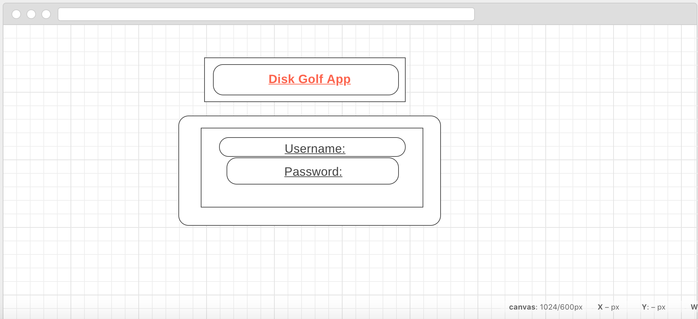
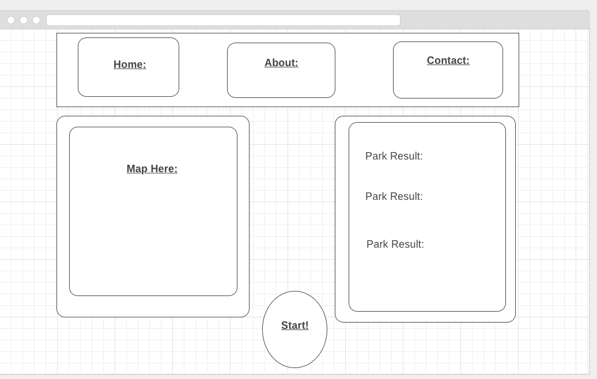
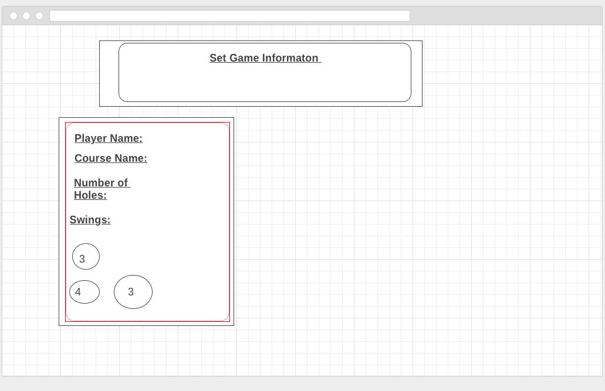
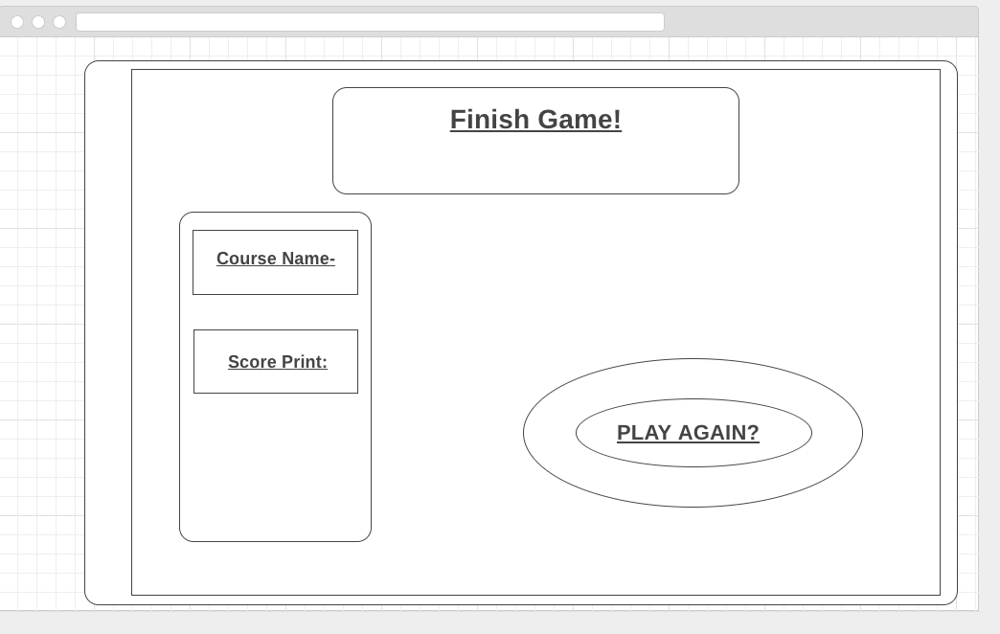

#  Project 3: React-Express-API

## This is my DiskGolf-App!

In the project directory, you can run:
 - Golfer uses google maps to find where the nearest parks are.

- Golfer sets up course details:
- number of holes in course
- Disk Throws per hole
-- at the end of the 18 (or how many holes that course has) holes a print of how many throws were thrown.

## WHY'S

- I made this app to use in real time while playing Disk Golf

- I hope it help people keep track of their game's progress more effectively.

- I feel there is not a lot of score keeping golf technology out there.

## Technology Used:

1. React JS
2. CSS
3. JavaScript
4. Node.js
5. Express
6. MongoDB and Mongoose
7. Surge (for deployment

## Trello Link
https://trello.com/b/pYahCcmJ/disk-golf-app

## Contributors, etc.

- Jim Haff Jimbojones1
- Ben Hankins WBHankins93
- Mariana Castro marianac94
- climberfields
- Sha flawgical
- mmirzabaig
